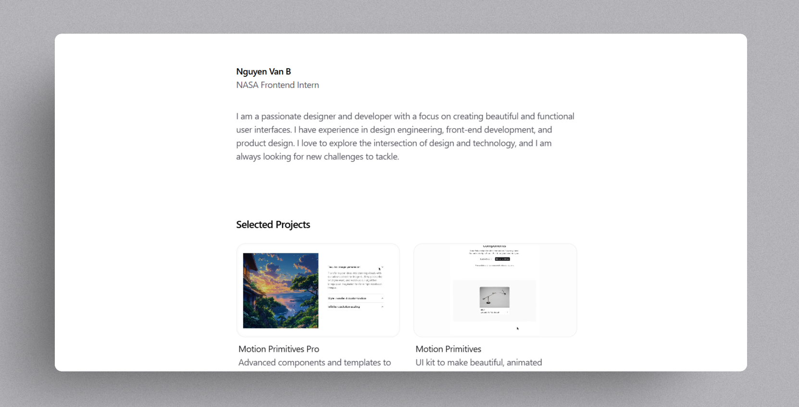

A personal website template, opinionatedly customized based on [Nim](https://github.com/ibelick/nim).

Nim is a free and open-source personal website template built with Next.js 15, React 19, Tailwind CSS v4, and Motion. Designed for developers, designers, and founders, it combines minimalism with delightful animated components powered by [Motion-Primitives](https://motion-primitives.com).

Live demo: [cs102-portfolio-template.onrender.com](https://cs102-portfolio-template.onrender.com/)

## Features

- Minimal one-page portfolio layout.
- Blog support with MDX.
- Responsive and accessible design.
- Easy to use
- [Motion-Primitives](https://motion-primitives.com) for animated components.

## Getting Started

For detailed setup instructions, refer to the [Installation Guide](./INSTALLATION.md) or the below.

```bash
git clone <current-repo-url>
cd <folder-name>
npm install
npm run dev
```

Open [http://localhost:3000](http://localhost:3000) with your browser to see the result.

### Customization
#### Basic Info
Edit the `app/data.ts` file to customize your personal information. Update the these contants with your name, title, and description.

```ts
export const EMAIL = 'my@email.com'

export const WEB_TITLE = 'Name - Personal Website'
export const WEB_DESCRIPTION =
  'A personal website showcasing my work and projects.'
export const FOOTER_COPYRIGHT = '© 2025 Nguyen Van B.'
export const FOOTER_LINK = 'https://github.com/username/'

export const NAME = 'Nguyen Van B'
export const JOB_TITLE = 'NASA Frontend Intern'
export const DESCRIPTION =
  'I am a passionate developer with a focus on creating beautiful and functional user interfaces.'
```

#### Social Links
Edit the `app/data.ts` file to customize your social links. Update the `SOCIAL_LINKS` array with your social media profiles.

```ts
export const SOCIAL_LINKS: SocialLink[] = [
  {
    ...
  },
  {
    label: 'LinkedIn',
    link: 'https://www.linkedin.com/in/username/',
  },
]
```

#### Project Showcase
Edit the `app/data.ts` file to customize your projects. Update the `PROJECTS` array with your project details.

```ts
export const PROJECTS: Project[] = [
  {
    ...
  },
  {
    ...
  },
  { // If the source end with .mp4, it will be treated as a video, otherwise as an image
    name: 'Another Project',
    description: 'A project description goes here.',
    link: 'https://github.com/username/project-name',
    video: "https://raw.githubusercontent.com/ibelick/nim/refs/heads/main/public/cover.jpg",
    id: 'project3',
  },
]
```

#### Work Experience
Edit the `app/data.ts` file to customize your work experience. Update the `WORK_EXPERIENCE` array with your work history.

```ts
export const WORK_EXPERIENCE: WorkExperience[] = [
  {
    ...
  },
  {
    company: 'NASA',
    title: 'Intern',
    start: '2025',
    end: 'Present',
    link: 'https://www.nasa.gov/careers/',
    id: 'work4',
  }
]
```

#### Add Blog Posts
Use markdown to write your blog posts. Create a new file in the `app/blog` directory with the `.mdx` extension. For example, create `app/blog/my-first-blog.mdx` and add your content.
```md
<!-- app/blog/my-first-blog/page.mdx -->
<!-- Optional Cover component -->
<Cover 
  src="https://cdn.pixabay.com/animation/2024/05/02/07/43/07-43-00-535_512.gif"
  alt="Image from pixabay.com"
  caption="Wow, confetti"
/> 

# My First Post
This is my first blog post using MDX.
```

For the frontend to know about your new blog post, you need to add it to the `app/data.ts` file.
```ts
// app/data.ts
export const BLOG_POSTS: BlogPost[] = [
  {
    ...
  },
  {
    title: 'My first blog - A journey on how I got here',
    description: 'A short description of me using MDX and Next.js.',
    link: '/blog/my-first-blog',
    uid: 'blog-2',
  },
]
```
## Contributing

This portfolio template is a forked version of [nim](https://github.com/ibelick/nim).
Contributions are welcome! Feel free to open issues or submit pull requests to improve Nim.

## Deployment

You can deploy your site to any hosting platform that supports Next.js or build it and serve it as regular static files.

## About

Nim is designed to make personal branding effortless and beautiful. If you enjoy it, consider sharing it and exploring [Motion-Primitives Pro](https://pro.motion-primitives.com/).
